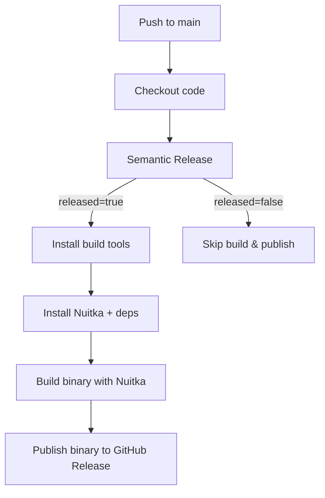

# Release Pipeline

This repository uses **[python-semantic-release](https://python-semantic-release.readthedocs.io/)**  
together with **GitHub Actions** to automate versioning, building, and publishing releases.

---

## 🔄 Workflow Overview

- **Trigger**: Any push to the `main` branch.
- **Versioning**:  
  - Commit messages follow [Conventional Commits](https://www.conventionalcommits.org/).  
  - `python-semantic-release` determines the next version (`fix`, `feat`, `BREAKING CHANGE`).
- **Release Steps**:
  1. **Checkout** the repository at the pushed commit.
  2. **Semantic Release**:
     - Bumps version in `pyproject.toml` / `__version__`.
     - Creates a Git tag.
     - Drafts a GitHub Release.
  3. **Build**:
     - Installs build tools (`ccache`, `g++`, `zlib1g-dev`).
     - Installs **Nuitka**.
     - Compiles `sentinel.py` into a standalone binary.
     - Uses **caching** for:
       - `pip` dependencies
       - Nuitka cache (`~/.cache/Nuitka`)
       - `ccache` (`~/.ccache`)
  4. **Publish**:
     - Uploads the built binary to the GitHub Release.

---

## 📦 Caching

To speed up builds, the workflow caches:

- **pip**: Python dependencies (Nuitka, setuptools, etc.)
- **Nuitka**: Compilation cache (`~/.cache/Nuitka`)
- **ccache**: C compiler cache (`~/.ccache`)

This ensures subsequent builds are much faster.

---

## 📊 Pipeline Flow (Mermaid)



---

## 📝 Commit Message Rules

Semantic Release uses commit messages to decide version bumps:

- `fix:` → **Patch** release (x.y.z → x.y.(z+1))
- `feat:` → **Minor** release (x.y.z → x.(y+1).0)
- `BREAKING CHANGE:` → **Major** release ((x+1).0.0)
- Other types (`ci:`, `docs:`, `chore:`) → no release

Example:

```text
feat(ci): add caching for Nuitka and ccache
```

This would trigger a **minor release**.

---

## 🔐 Permissions

The workflow requires:
- `contents: write` → to push tags and create GitHub Releases.

---

## ⚡ Tips

- Use `python -m nuitka` instead of `nuitka` to ensure the correct Python interpreter is used.
- Keep Nuitka pinned to a version (e.g., `nuitka==2.1.5`) for reproducible builds.
- Use `ccache` + `NUITKA_CACHE_DIR` to maximize build speed in CI.

---